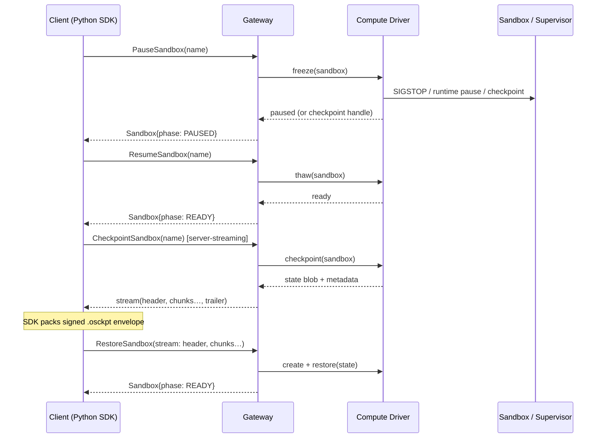

---
authors:
  - "@dhirajsb"
state: draft
links:
  - (originating GitHub issue — to be created; maintainers assign the RFC number there)
---

# RFC 0011 - Checkpoint, Pause, and Resume

<!--
See rfc/README.md for the full RFC process and state definitions.

NOTE ON NUMBERING: `0011` is a PROVISIONAL placeholder. Per rfc/README.md, RFC
numbers are assigned by maintainers on the originating GitHub issue before the
RFC branch is created. This document is published design-first in a fork for
early review; the number and originating-issue link must be reconciled before an
upstream PR is opened.

Contribution provenance: this proposal upstreams the pause/resume + portable
session-state capture capability from NVIDIA's internal "Astra Sandbox SDK"
(`sandbox.py` pause/resume) into OpenShell. Comparative-analysis contribution
ID: O5.
-->

## Summary

OpenShell sandboxes today have a two-state lifecycle from a client's point of
view: they are either running (`SANDBOX_PHASE_READY`) or gone
(`DeleteSandbox`). There is no way to suspend a sandbox so it stops consuming
compute while preserving its in-sandbox state, and no way to capture that state
as a portable artifact that can be archived, moved between gateways, or used to
reconstitute an equivalent sandbox later.

This RFC proposes three related capabilities, exposed through the Python SDK and
backed by new gateway RPCs and compute-driver contracts:

- **Pause / Resume** — suspend a running sandbox (freeze processes, stop billing
  for active compute where the driver supports it) and later resume it in place,
  preserving the running process tree and memory where the driver can, or
  restoring from a checkpoint where it cannot.
- **Checkpoint** — capture a sandbox's session state into a portable,
  integrity-protected artifact (the *OpenShell Checkpoint*, `.osckpt`).
- **Restore from checkpoint** — create a new sandbox initialized from a
  previously captured checkpoint.

The client-facing API is small: `pause()`, `resume()`, `checkpoint()`, and
`from_checkpoint()`. The bulk of the work — and the reason this starts as an RFC
rather than a pull request — is server-side: new gateway RPCs, a
`SANDBOX_PHASE_PAUSED` lifecycle state, a driver capability contract, and a
signed, versioned checkpoint envelope format.

## Motivation

Autonomous agents run for a long time and spend most of their wall-clock time
idle: waiting on a human review, on a scheduled trigger, on a rate limit, or
between steps of a multi-day task. Today the only way to stop paying for that
idle compute is to `DeleteSandbox`, which destroys all in-sandbox state — the
working tree, installed packages, warmed caches, running dev servers, and any
process state the agent built up. The next run starts from a cold image.

Several concrete workflows are poorly served by the current lifecycle:

- **Cost control for idle agents.** An operator running many agents wants to
  suspend sandboxes that are waiting on an external event and reclaim compute,
  then resume them within seconds when the event arrives — without losing the
  agent's working state.
- **Reproducible starting points.** A team wants a "golden" sandbox state (repo
  cloned, dependencies installed, tools configured) captured once and used to
  spin up N identical sandboxes, without re-running expensive setup each time.
- **Portability and archival.** A user wants to snapshot a sandbox at an
  interesting moment (a reproduction of a bug, an approved intermediate state)
  into a file they can store, attach to an issue, hand to a colleague, or
  restore on a different gateway or cluster.
- **Migration and maintenance.** An operator draining a node wants to checkpoint
  running sandboxes and restore them elsewhere rather than killing them.

NVIDIA's internal Astra Sandbox SDK already exposes `pause()`/`resume()` on its
sandbox object, and the capability has proven useful enough to upstream. This
RFC generalizes that experience into an OpenShell-native design that also covers
the *portable* checkpoint artifact, which Astra handles implicitly through its
managed backend and which OpenShell must define explicitly because its
checkpoints can cross trust boundaries (be written to disk, moved between
gateways, and restored by a different principal).

If we leave the design unchanged, users will keep emulating suspend/resume by
scripting `DeleteSandbox` + full re-provisioning, losing state and paying cold-
start costs, and there will be no supported way to move sandbox state between
gateways.

Because this changes the public API surface, adds a gateway-owned lifecycle
state, introduces a new persisted/exportable artifact format with its own
security properties, and requires a capability contract that every compute
driver (Docker, Kubernetes, VM) must reason about, it needs the cross-cutting
review an RFC provides rather than a single-component spike.

## Non-goals

- **Live migration with zero downtime.** Resume may incur a short freeze/thaw or
  a restore-from-checkpoint delay. Transparent live migration is out of scope.
- **Cross-architecture / cross-runtime restore.** A checkpoint captured on one
  CPU architecture or container runtime is not guaranteed to restore on a
  different one in phase 1. The format records provenance so mismatches are
  detected and rejected, not silently attempted.
- **Checkpointing GPU device state.** In-GPU memory and device context capture is
  explicitly deferred. Phase 1 targets CPU/process/filesystem state; GPU
  sandboxes may be checkpointable only in the "stopped" sense (filesystem +
  spec) and must declare this via driver capabilities.
- **Encryption of checkpoint payloads at rest.** The format is *integrity-*
  protected and *authenticated* (HMAC) in phase 1; confidentiality (encryption)
  is a follow-up (see Open questions). Operators must treat checkpoint files as
  sensitive until then.
- **Automatic idle-detection / auto-pause policy.** This RFC provides the
  mechanism (`pause`/`resume`); when to pause is left to the operator or a future
  policy/interceptor RFC.
- **A new storage backend for checkpoints.** Where checkpoint blobs live
  (gateway object store, external bucket, client disk) is discussed but the
  pluggable storage backend is a follow-up; phase 1 streams blobs through the
  gateway to the client.

## Proposal

### Overview



### Sandbox lifecycle changes

Add a paused state to the public lifecycle enum in `proto/openshell.proto`:

```proto
enum SandboxPhase {
  SANDBOX_PHASE_UNSPECIFIED = 0;
  SANDBOX_PHASE_PROVISIONING = 1;
  SANDBOX_PHASE_READY = 2;
  SANDBOX_PHASE_ERROR = 3;
  SANDBOX_PHASE_DELETING = 4;
  SANDBOX_PHASE_UNKNOWN = 5;
  SANDBOX_PHASE_PAUSING = 6;   // transitional: freeze in progress
  SANDBOX_PHASE_PAUSED = 7;    // stable: suspended, resumable
  SANDBOX_PHASE_RESUMING = 8;  // transitional: thaw in progress
}
```

`PAUSING`/`RESUMING` are transitional phases surfaced on `WatchSandbox` so
clients (and `wait_*` helpers) can observe progress. `PAUSED` is a stable phase.
A paused sandbox is not `READY`, so `exec` and new SSH sessions are rejected
with `FAILED_PRECONDITION` until it is resumed.

### New gateway RPCs

Add to the `OpenShell` service in `proto/openshell.proto`:

```proto
// Suspend a ready sandbox. Idempotent: pausing a PAUSED sandbox is a no-op.
rpc PauseSandbox(PauseSandboxRequest) returns (SandboxResponse);

// Resume a paused sandbox in place. Idempotent for a READY sandbox.
rpc ResumeSandbox(ResumeSandboxRequest) returns (SandboxResponse);

// Capture sandbox state and stream it to the client (server-streaming).
rpc CheckpointSandbox(CheckpointSandboxRequest) returns (stream CheckpointChunk);

// Create a new sandbox from a checkpoint streamed by the client
// (client-streaming): first message carries the header, subsequent messages
// carry payload chunks.
rpc RestoreSandbox(stream RestoreSandboxRequest) returns (SandboxResponse);
```

Request/response messages (abbreviated; full definitions land with the
implementation PR):

```proto
message PauseSandboxRequest {
  string name = 1;                       // canonical lookup key
  // Optional: also capture a checkpoint as part of pausing, for drivers that
  // implement pause via checkpoint-and-stop rather than in-place freeze.
  bool checkpoint_on_pause = 2;
  uint64 expected_resource_version = 3;  // optimistic concurrency, as elsewhere
}

message ResumeSandboxRequest {
  string name = 1;
  uint64 expected_resource_version = 2;
}

message CheckpointSandboxRequest {
  string name = 1;
  // When true, leave the sandbox PAUSED after checkpointing; when false, the
  // sandbox is resumed/left READY (driver permitting) after capture.
  bool pause_after = 2;
  map<string, string> labels = 3;        // opaque, stamped into checkpoint metadata
}

// Server-streamed checkpoint. The first CheckpointChunk MUST carry `header`;
// subsequent chunks carry `data`; the final chunk carries `trailer`.
message CheckpointChunk {
  oneof payload {
    CheckpointHeader header = 1;
    bytes data = 2;
    CheckpointTrailer trailer = 3;
  }
}

message CheckpointHeader {
  uint32 format_version = 1;
  string sandbox_id = 2;
  int64 created_at_ms = 3;
  string engine = 4;            // e.g. "criu", "runc-checkpoint", "fs-tar", "vm-snapshot"
  string engine_version = 5;
  string arch = 6;              // e.g. "x86_64", "aarch64"
  string driver = 7;            // originating compute driver name
  SandboxSpec spec = 8;         // spec needed to reconstruct the sandbox shell
  map<string, string> labels = 9;
}

message CheckpointTrailer {
  uint64 payload_size = 1;
  string sha256 = 2;            // hex digest of the concatenated payload
}

message RestoreSandboxRequest {
  oneof payload {
    RestoreHeader header = 1;   // first message
    bytes data = 2;             // subsequent messages
  }
}

message RestoreHeader {
  CheckpointHeader checkpoint = 1;
  string name = 2;              // optional name for the new sandbox
  map<string, string> labels = 3;
}
```

Rationale for streaming: checkpoint payloads can be large (hundreds of MB for a
process+memory snapshot). Streaming avoids buffering whole blobs in gateway
memory and lets the SDK compute the digest/HMAC incrementally.

### Compute-driver capability contract

Not every driver can do everything. Extend the driver capability snapshot
(`ComputeDriverCapabilities` in `proto/openshell.proto`, and the internal
`compute_driver.proto` contract) with checkpoint capabilities:

```proto
message ComputeDriverCapabilities {
  string driver_name = 1;
  string driver_version = 2;
  CheckpointCapabilities checkpoint = 3;  // new
}

message CheckpointCapabilities {
  bool pause_resume_in_place = 1;  // freeze/thaw without a full checkpoint
  bool checkpoint_export = 2;      // can produce a portable state blob
  bool restore_import = 3;         // can create a sandbox from a state blob
  repeated string engines = 4;     // e.g. ["criu", "fs-tar"]
  bool includes_process_memory = 5;// false => filesystem+spec only
}
```

The gateway rejects `PauseSandbox`/`CheckpointSandbox`/`RestoreSandbox` with
`UNIMPLEMENTED` when the active driver does not advertise the corresponding
capability, so the SDK gets a clear, typed signal rather than a partial result.

Expected phase-1 driver coverage:

- **Docker (single-player):** `pause_resume_in_place` via `docker pause`
  (cgroup freezer); `checkpoint_export` via CRIU (experimental) or a
  filesystem+spec tar fallback.
- **Kubernetes:** `pause_resume_in_place` may be limited; filesystem-based
  checkpoint via container checkpoint APIs (kubelet `checkpoint`) where
  available, else `UNIMPLEMENTED`.
- **VM driver:** `pause_resume_in_place` and `checkpoint_export` via hypervisor
  memory snapshot; strongest fidelity.

### The portable checkpoint format (`.osckpt`)

A checkpoint that leaves the gateway is a security-relevant artifact: it may be
written to disk, moved between machines, and later fed back into
`RestoreSandbox`. The SDK therefore wraps the gateway's streamed state into a
self-describing, integrity-protected envelope before handing it to the caller,
and verifies it on the way back in.

Envelope layout (little detail matters here, so it is specified precisely):

```text
+-----------+---------+------------+-----------------+--------------+---------+----------+
| magic (6) | ver (1) | hlen (4 BE)| header (hlen)   | plen (8 BE)  | payload | tag (32) |
+-----------+---------+------------+-----------------+--------------+---------+----------+
  b"OSCKPT"    0x01      uint32       canonical JSON     uint64        bytes    HMAC-SHA256
```

- `magic` = `OSCKPT`, `ver` = format version (1).
- `header` = canonical (sorted-key, compact) UTF-8 JSON of the checkpoint
  metadata: `format_version`, `sandbox_id`, `created_at_ms`, `engine`,
  `engine_version`, `arch`, `driver`, `digest` (sha256 hex of payload),
  `size_bytes`, and opaque `labels`.
- `payload` = the opaque state blob produced by the driver.
- `tag` = `HMAC-SHA256(key, magic || ver || hlen || header || plen || payload)`.

Two independent integrity checks are enforced on unpack:

1. **`digest`** (sha256 of payload, in the header) detects accidental
   corruption/truncation even without the key.
2. **`tag`** (HMAC over the whole envelope, verified with `hmac.compare_digest`)
   detects tampering and authenticates the writer. Restoring a checkpoint whose
   HMAC does not verify under the caller-supplied key raises
   `CheckpointIntegrityError` and never reaches `RestoreSandbox`.

The key is supplied by the caller (see security considerations). The format is
versioned via both `magic`+`ver` and the in-header `format_version` so future
revisions (e.g. an AEAD variant for confidentiality) can be introduced without
ambiguity, and old readers fail closed on unknown versions.

### Proposed Python API

The SDK gains four methods, surfaced consistently on `SandboxClient`,
`SandboxSession`, and the `Sandbox` context manager. Signatures:

```python
class SandboxClient:
    def pause(self, sandbox_name: str, *, checkpoint_on_pause: bool = False,
              timeout_seconds: float | None = None) -> SandboxRef: ...

    def resume(self, sandbox_name: str, *,
               timeout_seconds: float | None = None) -> SandboxRef: ...

    def checkpoint(self, sandbox_name: str, *, key: bytes,
                   pause_after: bool = True,
                   labels: Mapping[str, str] | None = None,
                   timeout_seconds: float | None = None) -> Checkpoint: ...

    def restore(self, checkpoint: Checkpoint, *, key: bytes,
                name: str | None = None,
                labels: Mapping[str, str] | None = None) -> SandboxRef: ...
```

Usage:

```python
from openshell import SandboxClient, Checkpoint

key = load_checkpoint_key()  # 32 bytes, caller-managed

with SandboxClient.from_active_cluster() as client:
    # Suspend an idle sandbox; compute is reclaimed, state preserved.
    client.pause("nightly-agent")
    # ... later ...
    client.resume("nightly-agent")

    # Capture a portable, signed checkpoint.
    ckpt = client.checkpoint("nightly-agent", key=key, labels={"reason": "golden"})
    Path("golden.osckpt").write_bytes(ckpt.to_bytes(key=key))

    # Reconstitute an equivalent sandbox elsewhere/later.
    blob = Path("golden.osckpt").read_bytes()
    restored = client.restore(Checkpoint.from_bytes(blob, key=key),
                              key=key, name="from-golden")
```

`Checkpoint` is a frozen dataclass holding `CheckpointMetadata` plus the opaque
payload, with `to_bytes(key=...)` / `from_bytes(blob, key=..., verify=True)`
implementing the envelope above. The metadata and envelope helpers are pure
client-side code with no server dependency; they ship first (see phasing) so the
format is reviewable and testable ahead of the gateway work.

### SDK-side scaffolding shipped with this RFC

To make the shape concrete and reviewable, this branch also adds *inert*
SDK scaffolding that does not require any server change:

- `openshell.checkpoint` module: the `.osckpt` envelope (`pack_checkpoint` /
  `unpack_checkpoint`), `Checkpoint` / `CheckpointMetadata` dataclasses, and
  `CheckpointError` / `CheckpointIntegrityError`. Fully implemented and unit-
  tested — this is the portable format, which stands alone.
- `SandboxClient.pause/resume/checkpoint/restore`, mirrored on `SandboxSession`
  and `Sandbox`, currently raising `NotImplementedError` with docstrings that
  point at this RFC. These lock in the public signatures for review without
  implying server support exists.

This lets reviewers evaluate the exact API and wire format now, and lets the
implementation phases fill in behavior behind an already-agreed surface.

## Implementation plan

The work is incremental and each phase is independently useful/reviewable.

1. **Format + inert SDK surface (this branch).** Ship `openshell.checkpoint`
   (envelope, dataclasses, integrity helpers) with tests, plus
   `NotImplementedError` method stubs on the SDK types. No server change; no
   behavior change for existing users.
2. **Proto + lifecycle.** Add `SANDBOX_PHASE_PAUSING/PAUSED/RESUMING`, the four
   RPCs, and the driver `CheckpointCapabilities`. Regenerate stubs. Gateway
   returns `UNIMPLEMENTED` for all four RPCs until a driver wires them.
3. **Pause/resume (in-place) for the Docker driver.** Implement freeze/thaw via
   the cgroup freezer, wire `PauseSandbox`/`ResumeSandbox`, surface transitional
   phases on `WatchSandbox`, and implement the SDK `pause()`/`resume()` bodies +
   `wait_paused`/`wait_ready` helpers.
4. **Checkpoint export/restore for one driver.** Implement `CheckpointSandbox`
   (server-streaming) and `RestoreSandbox` (client-streaming) for the driver
   with the strongest fidelity (VM or Docker+CRIU), including the digest/HMAC
   round-trip in the SDK.
5. **Broaden driver coverage** (Kubernetes, filesystem-only fallback) guided by
   advertised capabilities.
6. **Docs + examples.** Add a `docs/sandboxes/` page and a tutorial;
   fold the accepted design into `architecture/` per the RFC lifecycle.

Compatibility: all changes are additive. Old clients never call the new RPCs;
new clients degrade to a typed `UNIMPLEMENTED`/`NotImplementedError` against
drivers/gateways that lack support. The `SandboxPhase` enum only gains values;
existing values keep their numbers.

Validation: unit tests for the envelope (round-trip, tamper, truncation, wrong
key, unknown version); gateway integration tests per driver capability; an e2e
lane that pauses/resumes and checkpoints/restores a real sandbox and asserts
state survives.

## Risks

- **State fidelity varies by driver.** In-place freeze, CRIU process+memory
  capture, and filesystem-only snapshots have very different guarantees. A user
  may expect a resumed process tree and get a filesystem-only restore.
  *Mitigation:* the `CheckpointCapabilities.includes_process_memory` flag and
  the checkpoint `engine`/`arch`/`driver` provenance make the guarantee explicit
  and let the gateway reject mismatched restores instead of silently degrading.
- **Checkpoint files are sensitive.** A process-memory checkpoint can contain
  secrets, tokens, and user data. Phase 1 authenticates but does not encrypt.
  *Mitigation:* clear docs that files are sensitive; HMAC prevents tamper/forge;
  encryption is a defined follow-up; the format is versioned to add AEAD without
  breaking readers.
- **Restore is a code-execution boundary.** Feeding a crafted checkpoint into a
  driver's restore path is high-risk. *Mitigation:* mandatory HMAC verification
  under a caller-controlled key before the payload is sent to `RestoreSandbox`;
  gateway re-validates header/digest; drivers treat payloads as untrusted and
  restore into the same isolation a fresh sandbox gets.
- **Key management burden.** Requiring callers to supply an HMAC key adds
  friction and a way to lock themselves out of their own checkpoints.
  *Mitigation:* document a recommended key source; consider a gateway-managed
  keying option (Open questions) so the default path is turnkey.
- **Lifecycle complexity.** Three new phases and idempotency rules add surface
  area to every client `wait_*`/watch consumer. *Mitigation:* transitional
  phases are observable but terminal-state helpers (`wait_ready`,
  `wait_paused`) hide them; pause/resume are idempotent.
- **Driver divergence.** If drivers implement subtly different semantics,
  "checkpoint" becomes unportable in practice. *Mitigation:* the capability
  contract plus a shared conformance test suite define the minimum semantics.

## Alternatives

### Do nothing (script delete + re-provision)

Users can already stop paying for a sandbox by deleting it and re-creating it
from an image. This loses all in-sandbox state and pays cold-start setup every
time, and offers no portability. It is the status quo the motivation section
argues against; it remains available and is strictly weaker.

### Filesystem-only snapshots (no process/memory capture)

Restrict the feature to capturing the sandbox filesystem + spec, never process
or memory state. This is far simpler and portable across more drivers, but does
not satisfy "resume the running agent where it left off." Rather than choose, the
design makes memory capture a *declared capability*: filesystem-only is the
guaranteed floor, process/memory is available where the driver supports it.

### Gateway-owned checkpoint storage instead of a portable file

The gateway could store checkpoints internally and hand back opaque IDs, never
exposing bytes to the client. This is simpler to secure (bytes never leave the
trust boundary) but defeats the portability/archival motivation (move between
gateways, attach to an issue, hand to a colleague). The chosen design supports a
portable artifact now and leaves room for a gateway-storage backend as an
additive option (Open questions).

### Reuse `DeleteSandbox` + `CreateSandbox` with a state blob in the spec

Fold restore into `CreateSandbox` by allowing a state blob in `SandboxSpec`.
This avoids new RPCs but overloads create with large streamed payloads and a
second, awkward code path, and gives no home for pause/resume or streaming.
Dedicated streaming RPCs keep create simple and match the existing pattern of
per-capability RPCs (e.g. `ExecSandbox`).

## Prior art

- **NVIDIA Astra Sandbox SDK** exposes `pause()`/`resume()` on its sandbox
  object; this RFC upstreams that ergonomics and generalizes it with an explicit
  portable artifact (contribution O5). Astra's managed backend keeps state
  internal; OpenShell must define the artifact because its checkpoints can cross
  trust boundaries.
- **CRIU (Checkpoint/Restore In Userspace)** and **runc/containerd checkpoint**
  are the mechanisms the Docker/Kubernetes drivers would build on; they define
  what process/memory capture can and cannot do and motivate the
  `includes_process_memory` and `arch`/`engine` provenance fields.
- **Kubernetes container checkpointing** (kubelet `checkpoint` API, KEP-2008)
  informs the filesystem-oriented fallback and the "capability varies by
  platform" stance.
- **Firecracker / QEMU snapshot-restore** inform the VM driver path and the
  expectation that VM snapshots offer the strongest fidelity.
- **OpenShell RFC 0001 (drivers)** establishes the driver-as-extension-point
  boundary this RFC extends with checkpoint capabilities; **RFC 0010 (gateway
  interceptors)** establishes the additive-RPC + capability-advertisement style
  this RFC follows.
- **Signed software artifacts (e.g. the OIDC token bundle handling already in
  `sandbox.py`, TUF/Sigstore in spirit)** motivate authenticating a portable
  artifact rather than trusting bytes on disk.

## Open questions

- **Key management.** Should the gateway offer an optional managed-keying mode
  (gateway signs/verifies with a gateway-held key, keyed per principal) so the
  default path needs no user-supplied key, while still allowing caller-supplied
  keys for cross-gateway portability?
- **Confidentiality.** When do we add an encrypted (AEAD) envelope variant, and
  should it be a `format_version = 2` or a distinct magic? Encryption changes the
  key-management story materially.
- **Storage backend.** Should phase 1 already define a pluggable checkpoint
  storage interface (gateway object store / external bucket) or stream through
  the client only and add storage later?
- **Restore identity & policy.** Does a restored sandbox inherit the original's
  sandbox policy and attached providers verbatim, or must the caller re-attach?
  What is the correct default for provider credentials embedded in captured
  memory?
- **Resource-version semantics.** How do pause/resume interact with the
  optimistic-concurrency `expected_resource_version` used elsewhere, and should a
  paused sandbox's policy be mutable via `UpdateConfig`?
- **GPU sandboxes.** Is a filesystem+spec "stopped" checkpoint (no device state)
  useful enough to offer for GPU sandboxes in phase 1, clearly labeled, or should
  GPU sandboxes reject checkpoint entirely until device capture exists?
